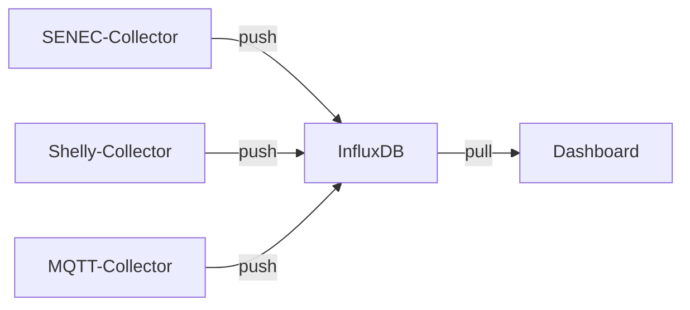
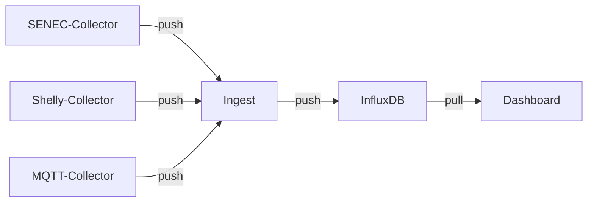

# Ingest

**Ingest** ist ein Ingestion-Proxy, der Messwerte aus verschiedenen Quellen (den Kollektoren) entgegen nehmen kann, einen korrigierten Hausverbrauch berechnet und dann an InfluxDB weiterleitet.

Der momentan **einzige Einsatzzweck** ist die Unterstützung von **Balkonkraftwerken** für SOLECTRUS. Wer ein solches nicht hat, für den bringt Ingest keinen Mehrwert. Der Einsatz wird dann nicht empfohlen.

Hintergrund ist, dass bei Verwendung von Balkonkraftwerken der vom Wechselrichter bzw. Stromspeicher gemeldete Hausverbrauch nicht korrekt ist, da eine direkte Einspeisung ins Hausnetz erfolgt. Der Hausverbrauch wird dadurch reduziert, entspricht also nicht dem tatsächlichen Verbrauch.

Der Hausverbrauch lässt sich aber rückwärts berechnen, wenn man die anderen Werte der Strombilanz kennt:

```
Hausverbrauch = Erzeugung vom Dach
              + Erzeugung des Balkonkraftwerks
              + Netzbezug
              + Batterieentladung (falls Batterie vorhanden)
              - Batteriebeladung (falls Batterie vorhanden)
              - Netzeinspeisung
              - Wallbox (falls vorhanden)
              - Wärmepumpe (falls vorhanden)
```

Und somit ergibt sich dieser Ansatz: Ingest wird zwischen die Kollektoren und InfluxDB geschaltet und erfährt somit alle relevanten Messwerte. Ingest berechnet dann permanent einen korrigierten Hausverbrauch und sendet diesen zusammen mit allen anderen Werten an InfluxDB.

Aufgrund eines Puffers kann Ingest auch dann den korrekten Hausverbrauch berechnen, wenn einzelne Lieferanten vorübergehend ausfallen und verspätet aufgelaufene Messwerte nachliefern. Ingest puffert alle Messwerte Daten 12 Stunden lang in einer SQLite-Datenbank. Anhand der gepufferten Messwerte wird eine Interpolation zu jedem beliebigen Zeitpunkt (der letzten 12 Stunden) möglich.

Das Zusammenspiel der Container ändert sich also wie folgt:

## Bisher (ohne Ingest)



## Mit Ingest



Damit wird Ingest zu einer kritischen Komponente, die im Fehlerfall den gesamten Datenfluss unterbricht. Daher ist es wichtig, dass Ingest permanent läuft - also genau wie InfluxDB auch.

## Quelltext

Ingest ist in Ruby implementiert, der Quelltext ist auf GitHub verfügbar: \
[github.com/solectrus/ingest](https://github.com/solectrus/ingest)
