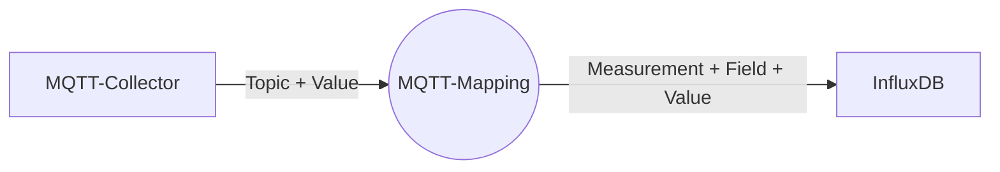
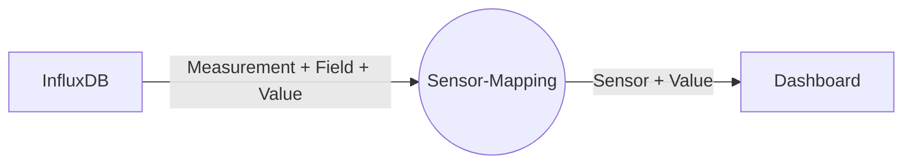

# Verwendung für SOLECTRUS

Der MQTT-Collector abonniert Topics bei einem MQTT-Broker, verarbeitet die empfangenen Werte und schreibt sie in eine InfluxDB. Prinzipiell ist das unabhängig von SOLECTRUS, aber üblicherweise wird der Collector in SOLECTRUS-Umgebungen eingesetzt. SOLECTRUS bedient sich dann der Werte aus der InfluxDB.

Für jedes abonnierte Topic, für das der MQTT-Collector Messwerte empfängt, wird einzeln über ein **Mapping** festgelegt, was mit den Werten geschehen soll und insbesondere wohin sie gespeichert werden sollen.

Der Collector muss sich an kein vorgegebenes Namensschema halten, sondern die Messwerte können inhaltlich (z.B. nach ihrer Quelle) strukturiert werden. Die Bezeichnungen von Measurements und Fields in der InfluxDB sind also frei wählbar.

Auch können Messwerte, die (noch) nicht von SOLECTRUS verarbeitet werden können, mit dem MQTT-Collector gesammelt werden können. Beispiele sind der Kilometerstand eines E-Autos, die Außentemperatur, ein CO2-Emissionsfaktor etc. Zukünftige Versionen von SOLECTRUS könnten diese Werte dann verarbeiten.

Wie das Mapping im Detail zu definieren ist, wird in der [Konfiguration](Konfiguration.md) beschrieben.

## Weiterverarbeitung in SOLECTRUS

SOLECTRUS holt sich die Werte aus der InfluxDB, ohne zu wissen, woher sie kommen. Das SOLECTRUS-Dashboard ist also völlig unabhängig von der Quelle der Messwerte. SOLECTRUS definiert dabei Sensoren, über die die Werte abgerufen werden. Die Sensoren sind also die Schnittstelle zwischen SOLECTRUS und der InfluxDB. Für den MQTT-Collector sind die Sensoren aber irrelevant.

Quelltext im GitHub-Repository: \
[github.com/solectrus/mqtt-collector](https://github.com/solectrus/mqtt-collector)
