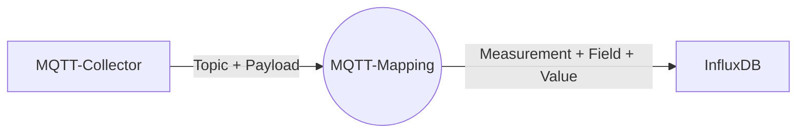
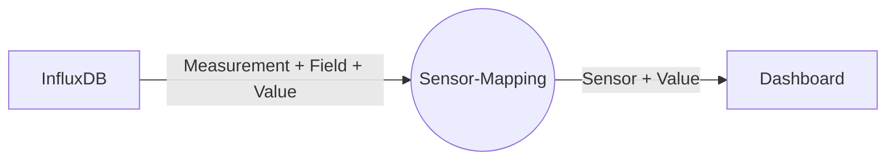

Der **MQTT-Collector** sammelt Messwerte über einen MQTT-Broker ein und schreibt diesen in die InfluxDB.

Im Gegensatz zu den spezialisierten Collectoren (z.B. für SENEC oder Shelly) ist das ein Allzweckwerkzeug, das Messwerte aus den verschiedensten Quellen verarbeiten kann.

Voraussetzung für diesen Collector ist ein funktionsfähiger MQTT-Broker. Dieser kann entweder im lokalen Netzwerk laufen (ioBroker oder Mosquitto sind gängige MQTT-Broker) oder auch ein Cloud-Service sein (z.B. HiveMQ).

Das übliche Einsatzgebiet ist die Anbindung von Geräten an SOLECTRUS, die nicht direkt unterstützt werden. Diese werden dann z.B. von einem ioBroker-Adapter abgefragt und die Werte per MQTT bereitgestellt, wo sie dann vom MQTT-Collector abgeholt werden.

Auf diese Weise können auch exotische Wallboxen, Wärmepumpen, Batteriespeicher, Wechselrichter, E-Autos etc. in SOLECTRUS eingebunden werden.

# Empfang von Messwerten

Der MQTT-Collector abonniert Topics bei einem MQTT-Broker, verarbeitet die empfangenen Werte und schreibt sie in eine InfluxDB. Prinzipiell ist das unabhängig von SOLECTRUS, aber üblicherweise wird der Collector in SOLECTRUS-Umgebungen eingesetzt. SOLECTRUS bedient sich dann der Werte aus der InfluxDB.

Für jedes abonnierte Topic, für das der MQTT-Collector Messwerte empfängt, wird einzeln über ein **Mapping** festgelegt, was mit den Werten geschehen soll und insbesondere wohin sie gespeichert werden sollen.



Der Collector muss sich an kein vorgegebenes Namensschema halten, sondern die Messwerte können inhaltlich (z.B. nach ihrer Quelle) strukturiert werden. Die Bezeichnungen von Measurements und Fields in der InfluxDB sind also frei wählbar.

Auch können Messwerte, die (noch) nicht von SOLECTRUS verarbeitet werden können, mit dem MQTT-Collector gesammelt werden können. Beispiele sind der Kilometerstand eines E-Autos, die Außentemperatur, ein CO2-Emissionsfaktor etc. Zukünftige Versionen von SOLECTRUS könnten diese Werte dann verarbeiten.

Wie das Mapping im Detail zu definieren ist, wird in der [Konfiguration](konfiguration) beschrieben.

:::note
Es ist wichtig, dass Messwerte **kontinuierlich** über den MQTT-Broker gesendet werden. Lücken im Datenempfang führen später in SOLECTRUS zu Problemen. Gängiges Negativ-Beispiel ist eine Wallbox, die nur bei Ladevorgängen den Verbrauch sendet. Es ist sicherzustellen, dass auch bei Nicht-Ladevorgängen kontinuierlich ein Verbrauch von 0 Watt gesendet wird, so dass keine Lücken entstehen. \
\
Falls also der MQTT-Broker eine Einstellung wie "Publish only on change" anbietet, so ist diese zu **deaktivieren**.
:::

## Weiterverarbeitung in SOLECTRUS

Das Dashboard von SOLECTRUS holt sich die Werte aus der InfluxDB, ohne zu wissen, woher sie kommen. Das SOLECTRUS-Dashboard ist also unabhängig von der Quelle der Messwerte. SOLECTRUS definiert dabei Sensoren, über die die Werte abgerufen werden. Die Sensoren sind also die Schnittstelle zwischen SOLECTRUS und der InfluxDB. Für den MQTT-Collector sind die Sensoren aber irrelevant.



## Protokollierung

Der Collector schreibt ein Protokoll ins Docker-Log, das im Normalfall so aussieht:

```log
MQTT collector for SOLECTRUS, Version 0.3.0, built at 2024-09-13T23:14:19.973Z
https://github.com/solectrus/mqtt-collector
Copyright (c) 2023-2024 Georg Ledermann and contributors, released under the MIT License

Using Ruby 3.3.5 on platform x86_64-linux-musl
Subscribing from MQTT broker at mqtt://192.168.178.31:1883
Pushing to InfluxDB at http://influxdb, bucket PV

Subscribing to 1 topics:

- MODBUS/BatteryLevel => SUNGROW:battery_soc (float)

# Message from 2024-10-02 10:00:44 +0200
  topic = MODBUS/BatteryLevel
  message = 42
  => SUNGROW:battery_soc = 42.0
...
```

Das Protokoll kann über folgenden Befehl abgerufen werden:

```bash
docker compose logs mqtt-collector
```

Bei Problemen oder Fehlern (z.B. wenn der MQTT-Broker oder die InfluxDB nicht erreichbar ist) wird dies ebenfalls protokolliert. Es empfiehlt sich daher, im Zweifelsfall zuerst das Protokoll zu prüfen.

## Quelltext

Der MQTT-Collector ist in Ruby implementiert, der Quelltext ist auf GitHub verfügbar: \
[github.com/solectrus/mqtt-collector](https://github.com/solectrus/mqtt-collector)
