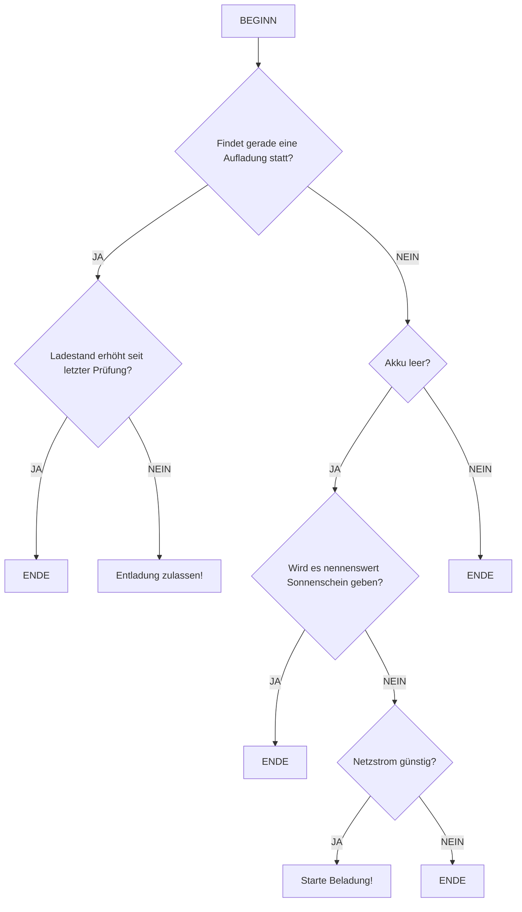

Eine Beladung erfolgt unter folgenden Bedingungen, die alle erfüllt sein müssen:

- Der Strompreis ist gerade besonders günstig
- Es ist nur wenig Solarstrom zu erwarten
- Der Speicher ist leer

Ob die Bedingung erfüllt ist, wird in regelmäßigen Abständen überprüft (normalerweise stündlich). Im Docker-Log wird genau protokolliert und begründet, ob eine Netzbeladung ausgelöst wurde oder nicht.

Wenn der Akku voll ist, wird die Ladung automatisch wieder frei gegeben.

## Flussdiagramm

Jede einzelne Prüfung finden nach einem festen Ablauf statt, der in folgendem Flussdiagramm dargestellt ist:

:::note
Der SENEC-Charger kann auch im Trockenlauf ("dry run") betrieben werden, d.h. es wird nur **simuliert**, ob der Speicher beladen werden würde, also ohne tatsächlich eine Beladung durchzuführen. Mehr dazu in der [Konfiguration](../konfiguration#charger_dry_run) unter `CHARGER_DRY_RUN`.
:::
